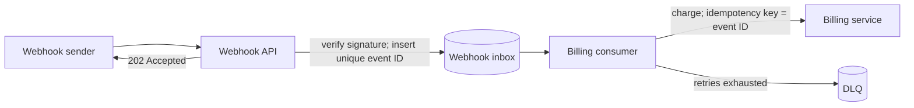

# Aptum

**适其人，适其事，适其言。**

Aptum 是一个面向 Claude Code、Codex 等 Agent 的表达判断 Skill。它帮助 Agent 根据实际读者、任务和交付场景，决定应该保留哪些事实、补充多少上下文、技术内容讲到什么程度，以及使用文字、表格还是图。

它始终围绕一个问题工作：

> 这个读者，在这个场景下，需要获得什么信息，才能正确理解或完成接下来的事情？

Aptum 不追求一律更短、更简单或更完整。它追求合适的信息密度：压缩表达，不压缩思想；简化理解成本，不简化真实问题。

[在 CSkills 查看 Aptum](https://skills.gz.cvte.cn/skill/aptum)

## 它解决什么问题

技术内容经常不是写错了，而是写给了一个不存在的“通用读者”：

- 给 Agent 的 handoff 缺少状态、文件和停止条件，接手者只能重新调查。
- 给项目工程师的说明复习大量共同基础，却没有接口边界和故障行为。
- 给当前用户的回复堆满术语，没有解释变化、原因和实际影响。
- 给新加入者的文档依赖此前聊天和项目历史，结论离开作者就无法成立。
- 为了“说人话”删掉失败路径、约束和不确定性；为了“完整”又把全部背景无差别塞进正文。

Aptum 让 Agent 在表达过程中持续感知三个维度：谁在读，他们要完成什么，以及什么信息和形式最适合当前场景。它也会区分已验证事实、基于证据的推断和 Agent 给出的建议，避免文风把三者混成同一种确定语气。

## 四个真实技术场景

下面的例子展示 Aptum 如何改变信息选择。重点不是把句子换得更自然，而是让读者拿到完成下一步真正需要的内容。

### 1. 同一段代码，写给不同读者

事实：`claimIdempotencyKey()` 使用 Redis `SET NX EX`，幂等键保留 24 小时。若先 `GET` 再 `SET`，并发 Worker 可能重复发送邮件。

写给当前用户：

> `claimIdempotencyKey()` 把“检查 request ID 是否存在”和“写入 request ID”合成一次原子操作。Redis 的 `SET NX EX` 表示：只有 key 不存在时才写入，并同时设置过期时间。若改成先 `GET` 再 `SET`，两个 Worker 可能同时看到 key 不存在，于是各自发送一封邮件。
>
> 这里的 24 小时 TTL（过期时间）是产品允许识别重复提交的窗口，不是普通缓存参数。缩短它会改变外部行为：较晚到达的客户端重试可能再次发送邮件。

写给维护该服务的工程师：

> `claimIdempotencyKey()` 使用 `SET key value NX EX 86400`，避免 `GET`/`SET` 之间的 TOCTOU race。TTL 是 request ID 的业务去重窗口，不是 cache tuning 参数；修改时需要同步评估 API 重试语义。

底层事实没有变化。前一版补了命令含义、竞态过程和产品影响；后一版保留团队能够直接使用的术语与较高密度，没有重新解释 Redis 并发基础。

### 2. Agent handoff：从“有进展”到“可以继续”

无法恢复上下文的 handoff：

> 数据库迁移基本做完了，测试大部分通过。接下来补一下剩余部分，然后发布。

使用 Aptum：

> 目标：把 `users.email` 改为 `NOT NULL`，但当前任务没有生产发布授权。
>
> 已完成：`migrations/20260901_backfill_user_email.sql` 已为 92% 的空值记录回填邮箱；`UserRepository` 的写入路径拒绝新的空值。`pnpm test user-repository` 的 24 个用例通过。
>
> 未完成：仍有 18,420 条历史记录无法从账号表推导邮箱。不要执行 `ALTER COLUMN SET NOT NULL`，否则迁移会失败。产品需要先决定这些记录是删除、使用占位地址，还是进入人工修复队列。
>
> 下一步：运行 `scripts/report-missing-email.ts --dry-run` 生成按租户分组的清单，把结果交给产品确认。确认处理规则前停止，不要部署。

第二版让新 Agent 不依赖此前 conversation 就能知道目标、证据、剩余风险、下一步和授权边界，也没有把完整日志原样倾倒进去。

### 3. ADR：不要让流畅语气改变证据等级

混在一起的写法：

> 我们将邮件发送改成队列，因为新架构会解决接口延迟问题，并显著提高系统可靠性。

使用 Aptum：

> **已验证事实**：同步调用邮件供应商时，通知 API 的 p95 延迟为 2.4 秒；供应商请求会持续占用 API worker。
>
> **决定**：API 写入 `notification-jobs` 后返回 `202 Accepted`，由 `EmailWorker` 异步发送。
>
> **推断**：该方案把供应商延迟移出请求链路，应能降低 API worker 占用。但生产容量尚未压测，不能把延迟改善写成已验证结果。
>
> **后果**：`202` 只表示任务已被接受，不再表示邮件已经送达。上线前必须补充队列积压告警和最终失败任务的重放能力。

Aptum 不要求永远使用这些标签；这里使用它们，是因为评审者需要区分测量结果、团队选择和仍待验证的预期。

### 4. 架构说明：关系复杂时让图承担关系

只有文字时，读者需要在脑中重建组件顺序：

> Webhook API 验证签名后，按 event ID 把事件写入 inbox，再返回 202。Consumer 从 inbox 读取事件，并使用同一个 event ID 作为幂等键调用 Billing。如果 Billing 失败，Consumer 会重试；最终失败的事件进入 DLQ。

在支持 Mermaid 的 README 或技术方案中，Aptum 会把主要调用链画出来：



> `202` 只确认事件已经持久化到 inbox。Inbox 对 event ID 有唯一约束，避免重复 webhook 创建两条任务；Consumer 调用 Billing 时继续传递 event ID，因为 at-least-once delivery 仍可能让同一任务执行多次。重试耗尽后，事件进入 DLQ，不会自动恢复。

图表达组件、边界和主路径；正文仍保留 `202` 的语义、重复投递条件和失败后的行为。若只需要说明“最终失败后进入 DLQ”，一句话会比这张图更合适。

## 适用场景

Aptum 可以参与 Agent 的即时回复，也适合编写和审阅：

- README、CLAUDE.md 和 AGENTS.md；
- ADR、RFC、技术方案和架构说明；
- 需求文档和产品方案；
- Issue、PR 和开发计划；
- Agent handoff；
- 代码解释与复杂技术问题分析。

## 安装

### CSkills

同时安装到 Claude Code 和 Codex：

```bash
cskills add aptum -g --agent claude-code,codex
```

只安装到一个客户端：

```bash
cskills add aptum -g --agent claude-code
cskills add aptum -g --agent codex
```

更新已安装版本：

```bash
cskills sync aptum
```

### 从 GitHub 手动安装

Claude Code：

```bash
git clone https://github.com/Zhong-Ze-Wei/aptum.git ~/.claude/skills/aptum
```

Codex：

```bash
git clone https://github.com/Zhong-Ze-Wei/aptum.git ~/.codex/skills/aptum
```

如果同时使用两个客户端，可以只保留一份仓库，再为另一个客户端创建软链接，避免两个副本逐渐不一致：

```bash
git clone https://github.com/Zhong-Ze-Wei/aptum.git ~/.codex/skills/aptum
ln -s ~/.codex/skills/aptum ~/.claude/skills/aptum
```

安装后重新打开客户端或开始新会话，让 Agent 重新发现 Skills。

## 使用

Agent 可以根据 `SKILL.md` 的 description 自动选择 Aptum。也可以直接说清读者和任务，例如：

```text
使用 Aptum，把这次缓存改动解释给懂后端开发、但不熟悉 Redis 一致性模型的当前用户。
```

```text
使用 Aptum，把当前进度写成一个新 Agent 可以直接继续的 handoff；保留文件、验证结果、未决项和禁止操作。
```

```text
使用 Aptum 审阅这份 ADR。不要只改文风，检查隐藏上下文、证据等级和失败边界。
```

## 文件组织

```text
aptum/
├── SKILL.md                  # 常驻的核心判断
├── agents/openai.yaml        # Codex 界面元数据
├── references/               # 按需加载的读者、交付物、表达和视觉原则
├── examples/                 # 四类读者与常见技术文档示例
└── evals/                    # 真实场景和语义评分标准
```

主文件保持紧凑。只有当任务涉及特定交付物、视觉关系或 AI 模板感时，Agent 才需要读取对应 reference。

## Aptum 不是什么

Aptum 不是固定写作模板、禁词表或“把技术内容说得越简单越好”的工具。它不会替代源代码、日志和数据核验，也不会覆盖项目已有的术语与 Style Guide。

它负责的是：让正确的信息，以适合当前的人、当前的事、当前的场景的方式抵达。
