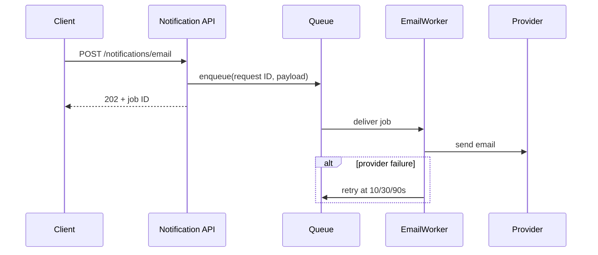

# 常见交付物片段

这些片段展示内容重心，不是固定模板。

## README：先让新读者成功一次

> `mail-gateway` 接收产品邮件请求，并把发送任务交给后台 Worker。API 返回 `202` 表示任务已接受，不表示邮件已送达。
>
> 本地运行需要 Node.js 22、Redis 和一个测试 provider token：
>
> ```bash
> pnpm install
> docker compose up -d redis
> pnpm dev
> ```
>
> 当日志出现 `email worker ready` 时，服务可以接收请求。失败任务会进入 `email-dlq`；当前版本只支持命令行重放。

README 把项目边界、成功信号和最早会踩到的语义放在第一次使用路径附近。

## ADR：保留当时的约束和后果

> **状态：Accepted，2026-08-28**
>
> 邮件供应商延迟使通知 API p95 达到 2.4 秒，并占用请求 worker。产品允许邮件最终送达，但要求客户端在 300 ms 内收到接收结果。
>
> 决定：API 入队后返回 `202`，由 `EmailWorker` 异步发送。继续同步调用不能满足延迟约束；让客户端直接调用供应商会暴露供应商凭据并破坏统一审计。
>
> 后果：API 延迟与供应商解耦，但 `202` 不再代表送达。系统必须提供幂等、积压告警、最终失败存储和重放能力。如果未来业务要求请求内确认送达，应重新评审本 ADR。

## 需求/产品文档：写可观察行为

> 当用户重复提交相同 request ID 时，系统只发送一封邮件，并为每次提交返回同一个任务 ID。去重窗口为首次接收后的 24 小时。
>
> 如果首次发送和后续三次重试均失败，任务状态变为 `failed`，运营人员可以按任务 ID 重放。重放不会绕过去重规则。
>
> 非目标：本期不提供邮件送达回执，也不保证供应商接受后的最终投递时间。

这里没有提前规定 Redis 数据结构，因为它不是产品可观察约束。

## 技术方案：让数据流可见



> 不变量：同一 request ID 在 24 小时窗口内最多创建一个发送任务。队列只提供 at-least-once delivery，因此 Worker 仍需在调用 provider 前检查幂等状态。图省略了最终失败写入 DLQ 的支线，失败策略在下一节单独说明。

图说明时序，正文保留队列语义和幂等边界。

## Agent handoff：让下一位能安全继续

> `workers/email.ts` 的重试逻辑和测试已完成。`pnpm test:integration email` 的 18 个用例通过。尚未实现 `scripts/replay-email-dlq.ts`，也未创建生产告警。
>
> 下一步先实现按 job ID 的 dry-run 查询，再增加显式 `--execute`；重放必须复用现有幂等检查。不要发布，当前任务没有生产授权。队列容量数据未知，不能把集成测试结果写成容量已验证。

## 代码说明：解释代码看不出的原因

> `claimIdempotencyKey()` 使用 Redis `SET NX EX`，把“检查”和“写入”合成一个原子操作。若先 `GET` 再 `SET`，两个 Worker 可能同时看到 key 不存在，并各自发送一封邮件。24 小时 TTL 是产品的重复提交窗口，不是缓存优化；修改它会改变外部行为。

这段说明聚焦并发原因和业务边界，没有逐行翻译函数。
