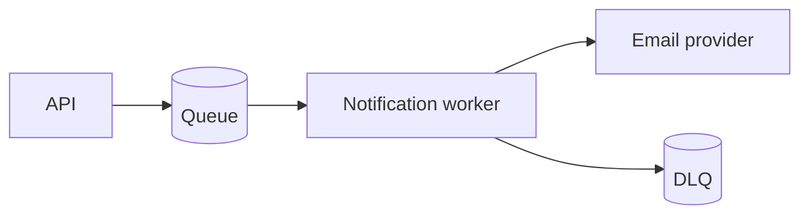

# 结构化视觉表达

视觉化的判断标准不是内容“够不够复杂”，而是图是否让关键关系更快、更少歧义地被看见。

## 值得画图的信号

当读者需要同时追踪三项以上实体之间的关系，或必须理解顺序、分支、状态、边界和前后变化时，优先考虑图。常见信号包括：

- 组件与依赖形成拓扑；
- 请求跨多个服务或角色；
- 数据经历多个转换或存储位置；
- 状态迁移受事件和条件控制；
- 新旧方案的路径不同；
- 系统边界与信任边界容易混淆。

一项映射、一个简单步骤或一段短因果链通常不需要图。图如果只是把同一组 bullet 放进方框，没有降低理解成本，就删掉。

## 选择最小合适形式

| 关系 | 首选形式 | 适合回答的问题 |
|---|---|---|
| 精确字段、方案或前后映射 | 表格 | 哪些项相同、不同或对应？ |
| 组件、依赖、数据流、边界 | Mermaid flowchart | 东西在哪里，经过谁？ |
| 跨角色调用和时间顺序 | Mermaid sequence diagram | 谁先做什么，失败发生在哪里？ |
| 生命周期与允许迁移 | Mermaid state diagram | 当前可到哪些状态，触发条件是什么？ |
| 简单层级或文件结构 | tree / ASCII | 谁包含谁，文件在哪里？ |
| 当前界面不可靠渲染图 | 紧凑文字、表格或 ASCII | 如何确保读者现在能看到？ |

## 图与正文如何分工

- 标题或引导句先说明图帮助读者看什么。
- 节点使用真实、稳定、简短的名称；术语与正文一致。
- 用 subgraph、颜色或注释只表达有意义的边界，不做装饰。
- 图中保留 happy path 和会改变判断的主要异常。细碎异常放正文或表格。
- 图后说明结论、不变量、失败行为和图中刻意省略的内容。
- 关键事实不能只存在于颜色、位置或图形中；保证纯文本和无障碍阅读仍能获得结论。
- 生成后检查 Mermaid 语法和目标渲染器支持。不要假定所有 Markdown 环境都支持最新语法。

## 小例子

适合用流程图表达系统边界：

正文仍需说明：API 在入队后返回；Worker 负责重试；只有最终失败的任务进入 DLQ。图不能替代这些行为约束。

若内容只是“首次发送和三次重试均失败后进入 DLQ”，一句话比状态图更好。
